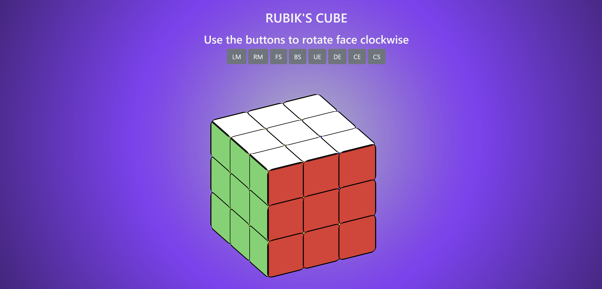
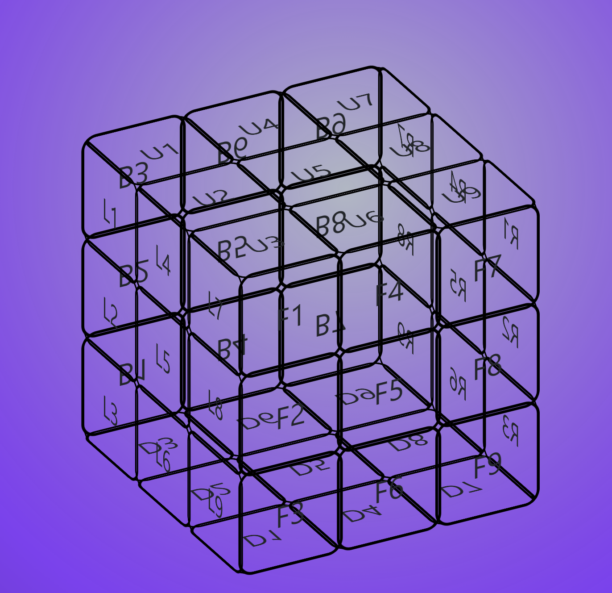

# Rubik's Cube Challange



The Challenge was to develop a program that simulates a Rubik’s cube. The aim of the program is not to solve the cube, just to 
develop a programmatic Rubik’s cube that can correctly rotate any face

This program was built using HTML, CSS and Javascript.


------

## Creating the Cube
The First part of the challenge was to create the cube. To create the cube 54 divs were created split into groups of 9 to represent the six faces (Up, Front, Back, Down, Left & Right).
Inside each div was a span which had the the face loacation and a number ie U1 was Up face cube 1, B3 was back cube 3.

```
<div class="square"><div><span>U1</span></div></div> 
```

To create a 3D cube the individual squares position per face needed identifying. Each div was given 3 unique letters as a class identifier based on the face, the row and the column  for the Up Face, Top Row, Left Column square it was given utl as a class identifier. 
```
<div class="utl square"><div><span>U1</span></div></div> 
```
```			    
            -----Up------							
		    |utl utc utr|						
		    |ucl ucc ucr|						
            |ubl ubl ubc|	 	  
----Left--------Front--------Right------Back-----
|ltl ltc ltr|ftl ftc ftr|rtl rtc rtr|btl btc btr|
|lcl lcc lcr|fcl fcc fcr|rcl rcc rcr|bcl bcc bcr|
|lbl lbc lbr|fbl fbc fbr|rbl rbc rbr|bbl bbc bbr|
----------------Down---------------------------- 
		    |dtl dtc dtr|						
		    |dcl dcc dcr|						
		    |dbl dbc dbr|						
            -------------				
```	

Using the class identifier the cubes could be positioned using CSS. Each div was targeted using the class and using transform to apply a 3D transformation by rotating the x and y axis and using translate3D. 
The up-face needed the x to be rotated 90deg, the down-face rotate the x -90deg, back-face rotate -180deg, left rotate y -90deg and right rotate y 90deg.
``` 
.utl {
    transform:rotateX(90deg) translate3d(50px,-100px,0);
}
```							

### Styling the cube
To style the cube in the CSS style sheet the cube was targeted and using "transform-style: preserve-3d;" and other stylings the skeleton of the 3d.



### Square colors
After creating the 3D skelleton a color was added to each of the squre divs based on the position of the face, using CSS the colors were allocated to each class 

- Up = white
- Left = green
- Front = red
- Right = blue
- Back = orange
- Down = yellow
 
## Cube Movements

There are three types of movements which the faces can be turned clockwise or anti-clockwise. These three moves were identified with the letters M, E and S: 
1. M - Left, center and right 
2. E - Up, center and down 
3. S - Front, center and back.

Each square then would have three movements. The top left square on the up face (utl) can move by rotating the left face, the up face or the back face, to mark these movements each of the divs have been allocated letters based on the face and the move so using the example of utl it would have LM, UE and BS.

After mapping the above movements the 18 rotational options and the position of each square after each rotation needed mapping. The rotations are either clockwise or Anti-clockwise LM, RM, CM, UE, CE, DE, FS, CS, BS. When LM is rotated clockwise the UTL square then becomes FTL square and so on. 
```
"LM-right":{
            "utl":"ftl","ucl":"fcl","ubl":"fbl","ftl":"dtl","fcl":"dcl","fbl":"dbl","dtl":"btl",
            "dcl":"bcl","dbl":"bbl","btl":"utl","bcl":"ucl","bbl":"ubl","ltl":"ltr","lcl":"ltc",
            "lbl":"ltl","ltc":"lcr","lbc":"lcl","ltr":"lbr","lcr":"lbc","lbr":"lbl","lcc":"lcc"
        },
```

## Controls
Input buttons were added so when clicked the rotation/movement was carried out. Using Javascript and a yahooapi called yui the script was configured so when the button was clicked the action was carried out.  


## Credits 
- YouTube 
- https://html5rubik.com/tutorial/
- Stack overflow 
